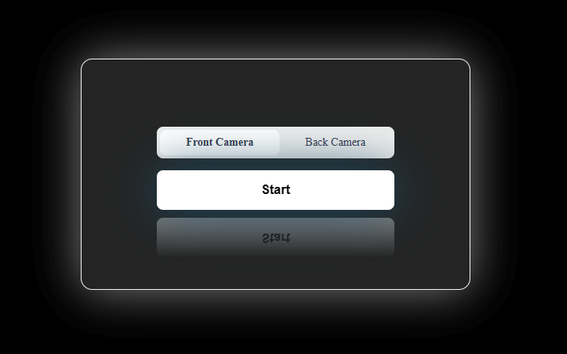

# Selfie Segmentation with MediaPipe JS

This is a javascript application that uses the webcam to perform selfie segmentation.



## Features

- **Real-time segmentation:** Uses MediaPipe's Selfie Segmentation for live video processing.
- **Dynamic camera selection:** Choose between multiple available camera inputs.
- **Fullscreen mode:** Toggle fullscreen display for the output canvas.
- **Simple user interface:** Start/stop camera operations with intuitive controls.

## Prerequisites

- [Node.js](https://nodejs.org/en/) (v12 or later)
- [npm](https://www.npmjs.com/)

## Installation

Clone the repository and install dependencies.

```bash
$ git clone https://github.com/Hal51AI/MediaPipeJS.git
$ cd MediaPipeJS
$ npm install
```

## Usage

### Start the Development Server

To run the application locally:

```bash
$ npm run dev
```

This will start the development server and launch the application in your default browser. The application will access your webcam, perform segmentation on the video feed, and display the results on a canvas.

Controls
- __Start Camera__: Use the UI button labeled "Start Camera" to begin capturing video.
- __Camera Selection__: Choose the desired camera (e.g., front or rear) if multiple options are available.
- __Fullscreen Toggle__: Click the fullscreen button to switch to fullscreen mode. Click anywhere on the document to exit fullscreen.

## Troubleshooting

- __Webcam Access Issues__: Make sure your browser has permission to access the webcam.
- __Dependency Installation__: If you encounter issues during npm install, ensure your Node.js and npm versions are up-to-date.
- __Development Server Errors__: Check the console output in VS Code's integrated terminal for any error messages.

## License
This project is licensed under the MIT License. See the LICENSE file for details.
